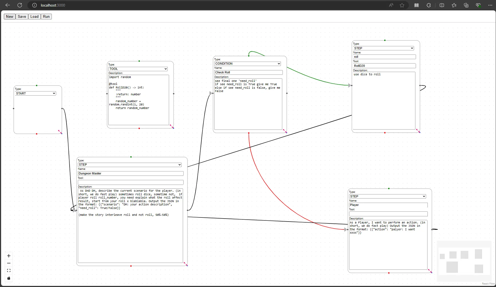

# LangGraph-GUI (ReactFlow)

LangGraph-GUI is a user-friendly interface for managing and visualizing Node-Edge workflows with LangGraph. It supports creating, editing, and running workflows locally using language models by Ollama.

This is node-edge based gui will export to json as saved graph. To execute json by LangGraph, you need to run [LangGraph-GUI-backend](https://github.com/LangGraph-GUI/LangGraph-GUI-backend)

This repo is implemented with ReactFlow. If you want Qt version frontend, see [LangGraph-GUI-Qt](https://github.com/LangGraph-GUI/LangGraph-GUI-Qt)

*If you want to learn more about LangGraph, we have LangGraph for dummy : [LangGraph-learn](https://github.com/LangGraph-GUI/LangGraph-learn)*



## Usage
For environment build up

```
npm install reactflow
```

In the project directory, you can run:
```
npm start
```
Runs the app in the development mode.\
Open [http://localhost:3000](http://localhost:3000) to view it in your browser.

The page will reload when you make changes.\
You may also see any lint errors in the console.


## Explanation

#### Start Node
A graph(json) only have one start node, this will mapping to LangGraph START


#### Step Node
Step Node will mapping to LangGraph add_node, you can drag edge from left node(right port) to right node(left port)


if you drag two node toward to each other, can create cycle.

#### Step Node with tool
Step node fill tool will call function, the tool definition need a tool node


#### Tool Node
Tool node need write real python function code, and need `@tool` decorator like LangChain Custom Tools


#### Contition Node
CONDITION node will mapping to LangGraph conditional_edge

* green edge is true case path
* red edge is false case path


